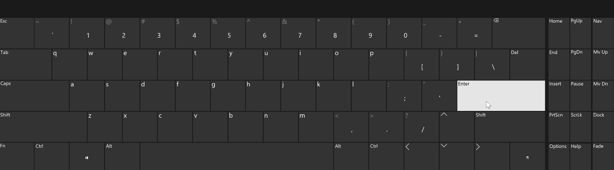

# tello-drone-bindings
Python 3 bindings to interact with the [DJI Ryze Tello
Drone](https://www.ryzerobotics.com/tello).




## Dependencies
* Python 3.x.x
* opencv-python
* Python h264decoder

## Instructions
1. Open a terminal and clone the repository locally.
```
git clone https://www.github.com/abx393/tello-drone-bindings.git
```

2. To install all dependencies except `h264decoder`, run the following. If
   you're on Windows and prefer the py.exe launcher, replace `python` with
`py`.

```
cd ~/tello-drone-bindings
python -m pip install -r requirements.txt
```

3. The h264decoder library might require the installation of some sub-dependencies.
   See detailed instructions [here](https://github.com/DaWelter/h264decoder).
4. Change your working directory to the src directory of the repository: 
```
cd ~/tello-drone-bindings/src
```

5. Run the following. If you're on Windows and prefer the py.exe launcher, replace `python` with
`py`.

```
python main.py
```

## Features
* Pilot drone with PC using customizable keyboard shortcuts (no joystick or controller necessary)
* View video stream of drone POV from PC in realtime.

### Current Key Bindings
| Key Binding | Control | Result |
| :---:   | :----:    | :----: |
|  `Enter` | take off | take off |
| `space` | land    |  land |
|  `w` | increase throttle | ascend |
| `s` | decrease throttle | descend |
| `a` | yaw left | rotate counter-clockwise |
| `d` | yaw right | rotate clockwise |
| `<left>` | roll left | move left |
| `<right>` | roll right | move right |
| `<up>` | pitch forward | move forward |
| `<down>` | pitch backward | move backward |
| `f` | flip | 360&deg; flip |

## References
* [https://github.com/dji-sdk/Tello-Python](https://github.com/dji-sdk/Tello-Python)
